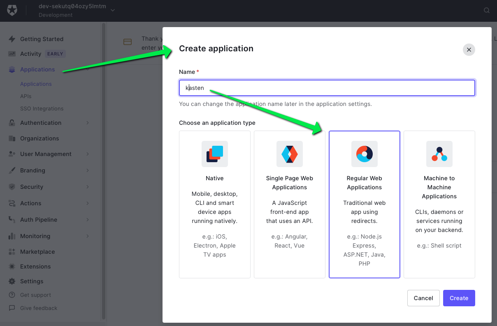
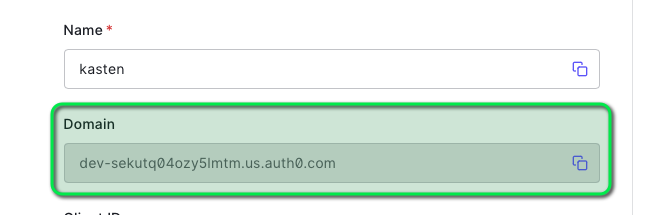
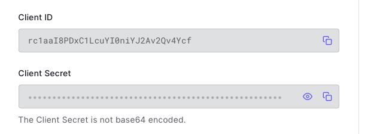
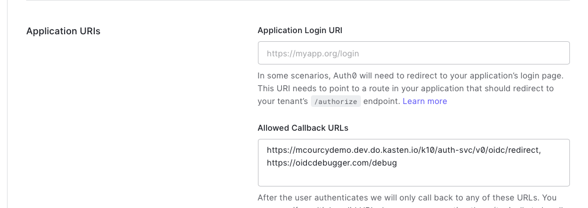
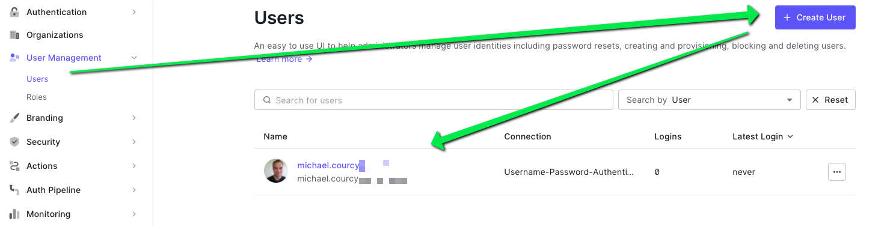
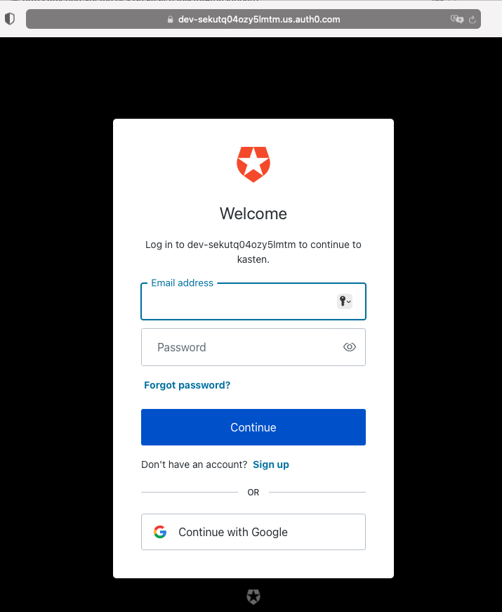
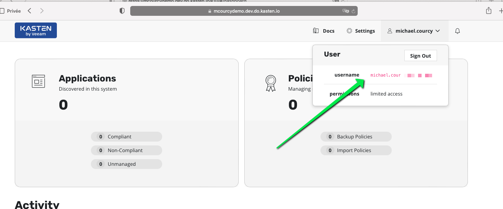

# Prequisite 

- Kubernetes up and running 
- An ingress controller with a valid certificate 

The goal is not to explain how we obtained those prerequisite because it will take us 
too far from our original goal but here is the example used for this tutorial

1. a kubernetes cluster up and running in digital ocean 
```
kubectl version  --short
Client Version: v1.24.0
Kustomize Version: v4.5.4
Server Version: v1.25.4
```

3. Certmanager to leverage letencrypt and obtain valid certificate 
```
helm list -n cert-manager
NAME            NAMESPACE       REVISION        UPDATED                                 STATUS          CHART                   APP VERSION
cert-manager    cert-manager    1               2023-03-13 13:24:57.275114219 +0000 UTC deployed        cert-manager-v1.5.4     v1.5.4 
helm get values cert-manager -n cert-manager
USER-SUPPLIED VALUES:
null
k get issuer -n cert-manager letsencrypt-prod -o yaml
apiVersion: cert-manager.io/v1
kind: Issuer
metadata:
  name: letsencrypt-prod
  namespace: cert-manager  
spec:
  acme:
    email: <redacted>
    preferredChain: ""
    privateKeySecretRef:
      name: letsencrypt-prod
    server: https://acme-v02.api.letsencrypt.org/directory
    solvers:
    - http01:
        ingress:
          class: nginx
```

2. The ingress controller was ngninx used with certmanager 
```
helm list -n kube-ingress
NAME            NAMESPACE       REVISION        UPDATED                                 STATUS          CHART                   APP VERSION
ingress-nginx   kube-ingress    1               2023-03-13 13:18:53.525936425 +0000 UTC deployed        ingress-nginx-4.5.2     1.6.4 
helm get values ingress-nginx -n kube-ingress 
USER-SUPPLIED VALUES:
controller:
  admissionWebhooks:
    enabled: false
  extraArgs:
    default-ssl-certificate: cert-manager/acme-crt-secret
  publishService:
    enabled: false
  service:
    annotations:
      external-dns.alpha.kubernetes.io/hostname: mcourcydemo.dev.do.kasten.io
    labels:
      k8s-addon: ingress-nginx.addons.k8s.io
    targetPorts:
      http: http
      https: https
defaultBackend:
  enabled: true
rbac:
  create: true
```

The annotation `external-dns.alpha.kubernetes.io/hostname: mcourcydemo.dev.do.kasten.io` will make sure that 
load balancer ip used by the nginx controller will be associated the name mcourcydemo.dev.do.kasten.io.


## Create an account with Okta Auth0 

Go to [Auth0](https://auth0.com) and create a free account. 

Create a regular web application 


Identify the domain.

```
YOUR_DOMAIN=dev-sekutq04ozy5lmtm.us.auth0.com
```

Check you get all information from the well_known url
```
curl https://$YOUR_DOMAIN/.well-known/openid-configuration | jq
```

This should give you this output

```
{
  "issuer": "https://dev-sekutq04ozy5lmtm.us.auth0.com/",
  "authorization_endpoint": "https://dev-sekutq04ozy5lmtm.us.auth0.com/authorize",
  "token_endpoint": "https://dev-sekutq04ozy5lmtm.us.auth0.com/oauth/token",
  "device_authorization_endpoint": "https://dev-sekutq04ozy5lmtm.us.auth0.com/oauth/device/code",
  "userinfo_endpoint": "https://dev-sekutq04ozy5lmtm.us.auth0.com/userinfo",
  "mfa_challenge_endpoint": "https://dev-sekutq04ozy5lmtm.us.auth0.com/mfa/challenge",
  "jwks_uri": "https://dev-sekutq04ozy5lmtm.us.auth0.com/.well-known/jwks.json",
  "registration_endpoint": "https://dev-sekutq04ozy5lmtm.us.auth0.com/oidc/register",
  "revocation_endpoint": "https://dev-sekutq04ozy5lmtm.us.auth0.com/oauth/revoke",
  "scopes_supported": [
    "openid",
    "profile",
....
}
```

Get specifically the issuer 
```
ISSUER=$(curl https://$YOUR_DOMAIN/.well-known/openid-configuration | jq -r '.issuer')
```

Identify also the clientid and clientsecret 

```
CLIENT_ID=rc1aaI8PDxC1LcuYI0niYJ2Av2Qv4Ycf
CLIENT_SECRET=<redacted>
```

Allow redirect to kasten `https://mcourcydemo.dev.do.kasten.io/k10/auth-svc/v0/oidc/redirect` 



Save and create a user in user management 


# Install 

```
kubectl create ns kasten-io 
cat <<EOF | helm install k10 kasten/k10 -n kasten-io - 
ingress:
  annotations:
    nginx.ingress.kubernetes.io/force-ssl-redirect: "true"
  class: nginx
  create: true
auth:
  k10AdminGroups: null
  k10AdminUsers: null
  oidcAuth:
    clientID: $CLIENT_ID
    clientSecret: $CLIENT_SECRET
    enabled: true
    groupClaim: groups
    groupPrefix: null
    logoutURL: https://google.com/accounts/Logout
    prompt: select_account
    providerURL: $ISSUER
    redirectURL: https://mcourcydemo.dev.do.kasten.io
    scopes: groups profile email
    usernameClaim: email
    usernamePrefix: null
EOF
```

## Test 

Connect to kasten `https://mcourcydemo.dev.do.kasten.io/k10/`

You should be redirected to the auth0 login 


Authenticate and you'll be redirected to Kasten 

